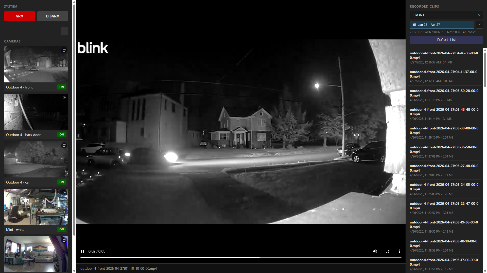

# Blink DVR

A local web dashboard and DVR for Blink home security cameras. Auto-downloads motion clips to your own storage, gives you a three-pane web interface to browse them, and lets you arm/disarm cameras without the Blink app.

Built because Blink doesn't have a desktop app and the official cameras don't expose a local API.


---

## ⚠️ Important Warnings — Read These First

- **A Blink subscription is REQUIRED.** Blink's free tier doesn't store clips on their servers, which means there's nothing for this script to download. You need either the **Blink Plus Plan** (~$10/month, unlimited cameras) or **Blink Basic Plan** (~$3/month per camera). A 30-day free trial is available — start there to test before committing.

- **Live streaming is not yet implemented in this dashboard, but it IS possible.** Blink uses a proprietary protocol called IMMIS (MPEG-TS over TCP) that has been reverse-engineered by the community. As of `blinkpy` 0.25+, livestream proxying is supported via the library's `BlinkLiveStream` class — see projects like [blinkbridge](https://github.com/roger-/blinkbridge) for a working RTSP bridge implementation. Adding native live view to this dashboard is on the roadmap.

- **No authentication on the web dashboard.** Anyone on your local network can access it. Don't expose port 5000 to the internet without adding authentication or putting it behind a VPN.

- **Your Blink password is stored locally** in `config/credentials.json` so the app can refresh tokens automatically. This file must never be shared or committed to a public repo. It's already in `.gitignore`.

- **The unofficial `blinkpy` API can break.** This was built against `blinkpy` 0.26. Future Blink server changes or `blinkpy` updates may require code adjustments. If something stops working, check the [`blinkpy` repo](https://github.com/fronzbot/blinkpy) for recent breaking changes.

- **This is unofficial.** It uses Blink's API in ways Amazon hasn't sanctioned. Amazon could change their API at any time, or theoretically flag accounts using third-party tools. Use at your own risk.

---

## Features

- Auto-downloads motion clips from Blink's cloud to a local folder
- Three-pane web dashboard: controls left, video preview center, clip list right
- ARM / DISARM the whole system or individual cameras
- Date range filter with calendar picker (Today, Yesterday, Last 7/30 days, custom)
- Filename search, combines with date filter
- Live thumbnail capture per camera
- Loop playback toggle
- Dark UI, vanilla JS, no frameworks

---

## Requirements

| Need | Version | Notes |
|---|---|---|
| Operating system | Windows 10 or 11 | The `.bat` files are Windows-specific. Linux/macOS users can adapt the Python scripts. |
| Python | 3.9 or newer | 3.12 or 3.13 recommended. Get from [python.org](https://www.python.org/downloads/). |
| Blink subscription | Plus or Basic | 30-day free trial works for testing. |
| Disk space | A few GB | Each clip is roughly 1-2 MB. 1000 clips ≈ 1.5 GB. |
| Network | Local | Cameras connect to Blink's cloud as normal; this PC pulls clips down to disk. |

---

## Step-by-Step Installation

### 1. Install Python

Download from [python.org/downloads](https://www.python.org/downloads/). During the installer:

- ✅ Check **"Add python.exe to PATH"** at the bottom of the first screen
- ✅ Use the default install location

Verify it worked. Open Command Prompt (cmd) and run:

```bat
python --version
```

You should see `Python 3.12.x` or similar. If it says "command not found" or shows an old version, the PATH didn't get set. Reinstall and make sure that checkbox is checked.

### 2. Get the Code

Clone this repo (if you have Git installed):

```bat
git clone https://github.com/YOUR_USERNAME/blink-dvr.git C:\BlinkDVR
```

Or download the ZIP from GitHub and extract to `C:\BlinkDVR`.

### 3. Set Up the Python Environment

A virtual environment isolates this project's libraries from your system Python.

```bat
cd /d C:\BlinkDVR
python -m venv venv
venv\Scripts\activate
pip install -r requirements.txt
```

You should see `(venv)` appear in your prompt after activating. The `pip install` step pulls down ~15 MB of libraries and takes under a minute.

### 4. Configure Settings

Copy the example settings file and edit it:

```bat
copy config\settings.ini.example config\settings.ini
notepad config\settings.ini
```

Set in settings.ini

username — your Blink account email 
output_dir — where you want clips saved (defaults to C:\BlinkDVR - SHARED\clips\ inside the project folder; change to a different drive if you want separation, e.g., H:\blinkDVR\clips\)

The other settings have sensible defaults; leave them alone unless you want to change polling frequency or retention.

### 5. First Login (One-Time Setup)

This walks through Blink's 2FA flow and saves OAuth tokens so future runs are silent:

```bat
python first_login.py
```

You'll be prompted for:
1. Your Blink email
2. Your Blink password (won't echo as you type — that's normal)
3. The 2FA code Blink emails or texts to you

After success you'll see your camera list. A `config/credentials.json` file is created. **Don't share or commit this file** — it contains tokens that can access your Blink account.

### 6. Test Run

Verify everything works by starting both processes manually:

**In one cmd window:**
```bat
cd /d C:\BlinkDVR
venv\Scripts\activate
python blink_dvr.py
```

**In a second cmd window:**
```bat
cd /d C:\BlinkDVR
venv\Scripts\activate
python web_app.py
```

Open `http://localhost:5000` in your browser. You should see the dashboard with your cameras.

Trigger motion on a camera. Within ~90 seconds you should see a new clip appear in the right panel. If that works, you're done — close both windows and proceed.

### 7. Easy Startup with `start_blink.bat`

Instead of manually opening two cmd windows every time, use the launcher:

Double-click `start_blink.bat` in File Explorer. It:
- Starts the clip poller in a minimized window
- Starts the web server in a minimized window
- Waits 4 seconds then opens the dashboard in your browser

To stop everything: close the two minimized cmd windows in your taskbar.

---

## Auto-Start with Windows

You have two options, in increasing order of "set it and forget it":

### Option A: Start Menu Shortcut (Easy, Manual Click)

1. Right-click `start_blink.bat` → **Show more options** → **Send to** → **Desktop (create shortcut)**
2. Right-click the new desktop shortcut → **Cut**
3. Open File Explorer, paste this path in the address bar:
```
   %APPDATA%\Microsoft\Windows\Start Menu\Programs
```
4. Right-click in the folder → **Paste**

Now "Blink DVR" appears in your Start menu. Click it to launch.

### Option B: Auto-Start When You Log Into Windows

1. Press `Win+R`, type `shell:startup`, press Enter
2. A Startup folder opens
3. Right-click → **New** → **Shortcut**
4. Browse to `C:\BlinkDVR\start_blink.bat`
5. Name it "Blink DVR"

Every time you log into Windows, both processes spin up automatically and the dashboard opens in your browser.

### Option C: Run as a Background Service (Most Robust)

For true 24/7 operation that works even when no user is logged in, use **Task Scheduler**:

1. Press `Win+R`, type `taskschd.msc`, press Enter
2. Click **Create Basic Task** in the right panel
3. Name: `Blink DVR`
4. Trigger: `When the computer starts` (or `When I log on` if you prefer)
5. Action: `Start a program`
6. Program: `C:\BlinkDVR\start_blink.bat`
7. Finish

For maximum robustness, after creating it: right-click the task → Properties → **General** tab → check "Run whether user is logged on or not."

---

## Using the Dashboard

Open `http://localhost:5000` from the PC, or `http://YOUR_PC_IP:5000` from any other device on the same WiFi (find your PC's IP with `ipconfig`).

### Left Panel — Controls

- **ARM / DISARM** buttons — toggle the whole sync module on/off
- **⋮ Settings** menu — toggle video playback looping
- **Camera tiles** — show current thumbnail and motion-enabled state
- **Click a thumbnail** to capture a fresh image (takes ~10 seconds)
- **ON/OFF button** per camera — toggle motion detection for just that camera
- **Refresh All Thumbnails** — captures fresh images for every camera at once (battery-cost on Outdoor models)

### Center Panel — Video Preview

- Click any clip in the right panel to play it here
- Video fills the entire panel, scales to fit
- Loops by default (toggle in ⋮ Settings)
- Controls (play/pause/seek/volume) appear when you hover

### Right Panel — Clip List

- All downloaded clips, newest first
- **Search box** — type and press Enter to filter by filename
- **Date filter** — calendar popup with presets and custom range
- **Filters combine** — search AND date both apply at once
- **Refresh List** — re-reads files from disk (use this if a new clip just downloaded)

---

## Command-Line Tools

For automation or scripting beyond the web UI:

```bat
python arm_control.py status
python arm_control.py arm
python arm_control.py disarm
python arm_control.py enable "Camera Name"
python arm_control.py disable "Camera Name"
```

You can chain these in batch files for scenes — e.g., a "bedtime" batch that arms everything except the bedroom camera, or a Task Scheduler entry that arms at 11 PM and disarms at 6 AM.

---

## Troubleshooting

### `pip install` fails with Python version errors

Your Python is older than 3.9. Upgrade per Step 1, then:

```bat
rmdir /s /q venv
python -m venv venv
venv\Scripts\activate
pip install -r requirements.txt
```

### The dashboard loads but shows "Loading..." forever

`web_app.py` isn't running, or it crashed. Check the cmd window you started it in for errors.

### No clips are downloading

Check in this order:

1. Is `blink_dvr.py` running? Look for its cmd window in your taskbar.
2. Is your Blink subscription active? Check the Blink phone app.
3. Is the system armed? Run `python arm_control.py status` to verify.
4. Are individual cameras enabled? Same status command shows per-camera state.
5. Does the Blink phone app's Clip Roll show recent clips? If yes but local doesn't, there's a script issue. If no, Blink isn't recording.
6. Check the poller log: `C:\BlinkDVR\logs\blink_dvr.log`

### "BlinkTwoFARequiredError"

Your saved tokens expired. Delete `config/credentials.json` and re-run `python first_login.py`.

### Mini cameras work in app but not in script

Indoor Mini cameras are a different device class than Outdoor cameras and their settings can differ. Make sure motion is enabled on each Mini specifically:

```bat
python arm_control.py status
python arm_control.py enable "Mini - white"
```

### Multiple Python processes running

If `tasklist | findstr python` shows more than 2 processes, you've accidentally started extra copies. Kill them all and restart:

```bat
taskkill /F /IM python.exe
start_blink.bat
```

### Port 5000 already in use

Another app is using port 5000. Either close that app, or edit `web_app.py` and change `port=5000` to `port=5001` (or any free port).

---

## Architecture

```
Blink Cloud Servers
        ↓
   (polled every 60 sec)
        ↓
   blink_dvr.py  ─────────►  H:\BlinkClips\*.mp4
                                       ▲
                                       │ reads
                                       │
                              web_app.py (Flask, port 5000)
                                       ▲
                                       │ HTTP
                                       │
                              Browser dashboard
```

`blink_dvr.py` and `web_app.py` are independent processes that don't talk to each other. The poller writes files; the web app reads files. Either can run without the other.

The dashboard's "ARM / DISARM" and "Enable / Disable" buttons make API calls to Blink directly through `web_app.py` — they don't go through `blink_dvr.py`.

---

## File Reference

| File | What It Does |
|---|---|
| `blink_dvr.py` | The clip-downloader poller. Runs continuously. |
| `web_app.py` | Flask web server for the dashboard. |
| `first_login.py` | One-time interactive 2FA login. |
| `arm_control.py` | CLI tool for system / camera arm-disarm. |
| `templates/index.html` | The dashboard UI (single-page). |
| `config/settings.ini.example` | Example config; copy to `settings.ini` and edit. |
| `config/credentials.json` | Auto-generated by `first_login.py`. NEVER share. |
| `requirements.txt` | Python dependencies. |
| `start_blink.bat` | Launcher for the whole system. |
| `enable_all.bat` / `disable_all.bat` | Bulk camera motion toggles. |
| `clips/` (or wherever you point `output_dir`) | Downloaded MP4s. |
| `static/thumbs/` | Cached camera thumbnails. |
| `logs/blink_dvr.log` | Rotating log file from the poller. |

---

## Roadmap / Adding to the Project

The code is intentionally simple and self-contained. Some natural extensions:

- **Live view via IMMIS / MPEG-TS streaming** using `blinkpy`'s built-in `BlinkLiveStream` class (planned)
- **RTSP feed integration** for additional non-Blink cameras (Reolink, Tapo, Wyze, etc.) in the same dashboard
- **Auto-refresh** the clip list every 30 seconds so new ones appear without clicking
- **Per-camera filter dropdown** to view clips from one camera at a time
- **HTTP basic auth** to lock the dashboard down even on local network
- **Discord / Telegram notifications** when motion clips arrive

---

## Credits

- Built on top of the excellent [`blinkpy`](https://github.com/fronzbot/blinkpy) library by Kevin Fronczak. Without it, accessing Blink's API would be a far bigger project.
- Original Blink protocol reverse engineering by [MattTW](https://github.com/MattTW/BlinkMonitorProtocol).
- Flask for the web framework, doing what it always does — getting out of the way.

---

## License

Released under the **MIT License** — do whatever you want with this code: use it, modify it, redistribute it, sell it. No warranty, no obligation, no copyright restrictions on your use.

```
MIT License

Permission is hereby granted, free of charge, to any person obtaining a copy
of this software and associated documentation files (the "Software"), to deal
in the Software without restriction, including without limitation the rights
to use, copy, modify, merge, publish, distribute, sublicense, and/or sell
copies of the Software, and to permit persons to whom the Software is
furnished to do so, subject to the following conditions:

The above copyright notice and this permission notice shall be included in
all copies or substantial portions of the Software.

THE SOFTWARE IS PROVIDED "AS IS", WITHOUT WARRANTY OF ANY KIND, EXPRESS OR
IMPLIED, INCLUDING BUT NOT LIMITED TO THE WARRANTIES OF MERCHANTABILITY,
FITNESS FOR A PARTICULAR PURPOSE AND NONINFRINGEMENT. IN NO EVENT SHALL THE
AUTHORS OR COPYRIGHT HOLDERS BE LIABLE FOR ANY CLAIM, DAMAGES OR OTHER
LIABILITY, WHETHER IN AN ACTION OF CONTRACT, TORT OR OTHERWISE, ARISING FROM,
OUT OF OR IN CONNECTION WITH THE SOFTWARE OR THE USE OR OTHER DEALINGS IN
THE SOFTWARE.
```

If you don't want to bother with a LICENSE file separately, this is fine inline. If you want a separate `LICENSE` file (which is GitHub's convention and shows the license badge nicely), copy the text from "MIT License" through the end into a file called `LICENSE` (no extension) in your repo root.